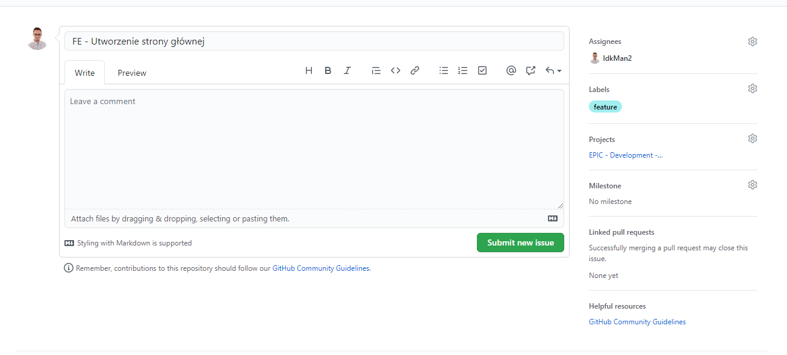
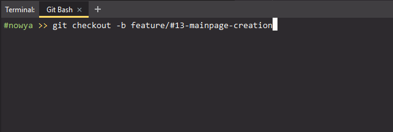
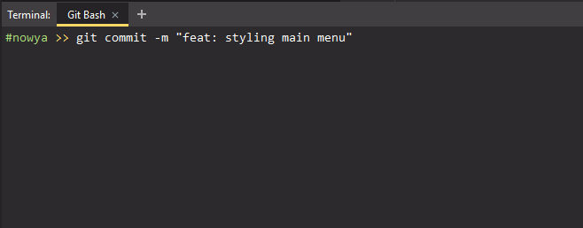
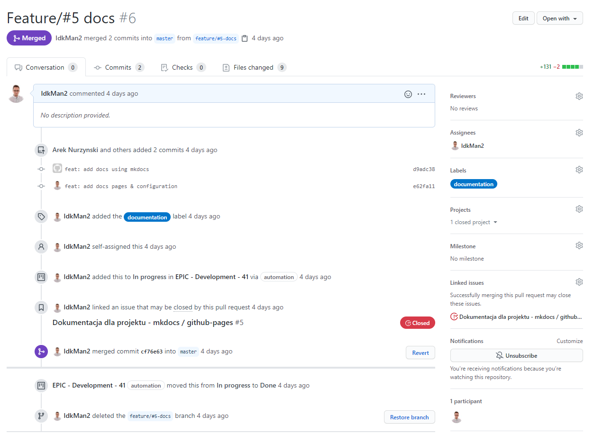
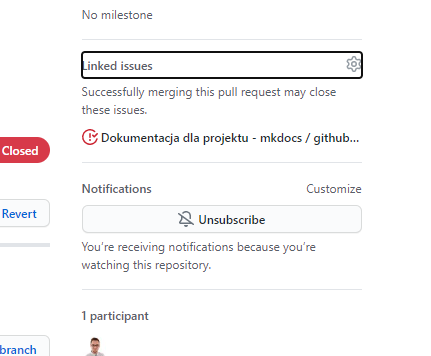
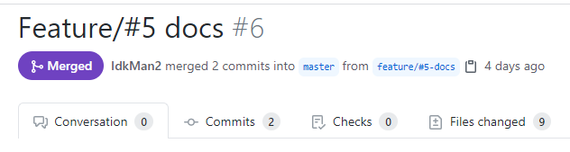
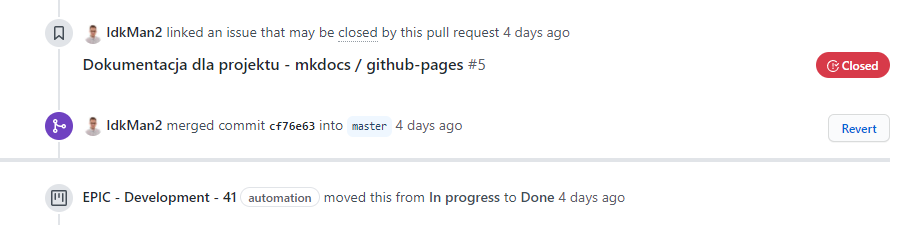

---
## Step 1 - Tworzymy issue na githubie



Dodajemy tytuł z przedrostkami tematu, którego issue dotyczy, na przykład stylowanie strony głównej może mieć tytuł:

```text
FE - mainpage - stylowanie
```

*PS: `FE` oznacza `Front-End` i `BE` analogicznie.*

Do tego opis krótki opcjonalnie.

**Koniecznie** assigne na siebie, labelki i projekt na obecny tydzień.

---
## Step 2 - Tworzymy branch odbijając mastera, bądź deva



!!! warning "Wymagane poprawne nazewnictwo gałęzi"
    Czytaj więcej w [poradniku Git](./git.md)

---
## Step 3 - Pracujemy, commitujemy i push



!!! warning "Wymagane poprawne nazewnictwo commitów"
    Czytaj więcej w [poradniku Git](./git.md)

---
## Step 4 - Tworzymy pull-request do branchu docelowego



Branch docelowy prawdopodobnie będzie `master` lub `dev`, do uzgodnienia, bo back-end może mieć inne potrzeby od `front-endu`.

---
## Step 5 - Podpinamy pull-request do naszego issue



---
## Step 6 - Pchamy pull-request do branchu docelowego



!!! danger ""
    Zawsze używaj opcji `squash-and-merge`, aby wszystkie swoje commity "zamknąć" pod jednym, większym, aby nie zaciemniać historii developmentu na docelowym branchu.
    
---
## Step 7 - Zamykamy issue



Automatyzacja automatycznie pchnie issue do odpowiedniej kolumny.

!!! warning ""
    Automatyzacja tasków działa tylko dla projektu obecnego tygodnia. 
    Jeżeli twój task (issue) jest podpięty do projektu na miniony tydzień - koniecznie zmień projekt na obecny tydzień (tzw. wersjonowanie).  

<br/><br/>
